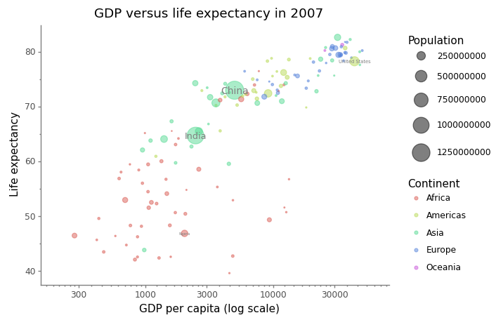
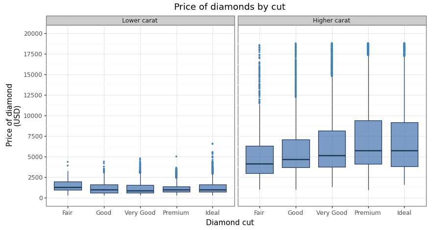

# Plotnine
Boilerplate Code for Make Better Pictures in Python with Plotnine.

[Plotnine](https://plotnine.readthedocs.io/en/stable/) is a port to python of the famous R library, [ggplot](https://ggplot2.tidyverse.org/).

# Pictures Examples

Plotnine offers us a better and powerful way to build beautiful pictures. 

# Useful Tutorials and Blogs

- [Show counts and percentages for bar plots](https://plotnine.readthedocs.io/en/stable/tutorials/miscellaneous-show-counts-and-percentages-for-bar-plots.html)
- [Custom sorting of plot series](https://plotnine.readthedocs.io/en/stable/tutorials/miscellaneous-order-plot-series.html)
- [Plotting with `plotnine`](https://www.practicaldatascience.org/html/plotting_part1.html)
- [Making beautiful boxplots using plotnine in Python](https://t-redactyl.io/blog/2020/09/making-beautiful-boxplots-using-plotnine-in-python.html)